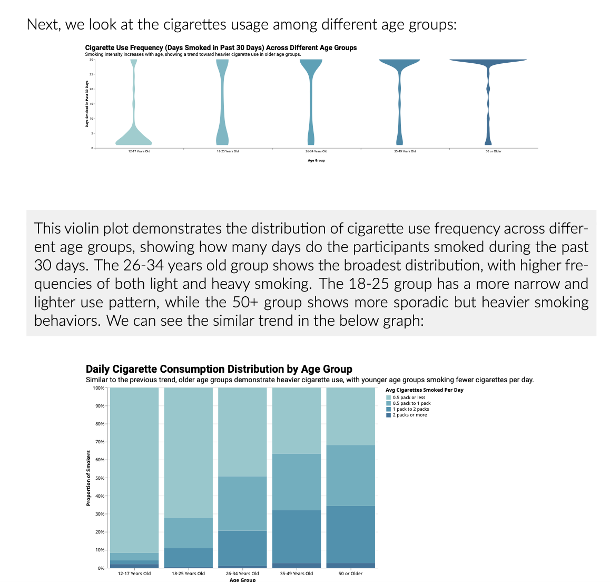

# Tobacco Use Insights: Trends, Demographics, and Policy Impacts
## Yi-Huai Chang
## Description
According to [Chicago Department of Public Health(CDPH)](https://www.chicago.gov/city/en/depts/cdph/provdrs/healthy_living/news/2020/september/youth-cigarette-use-reaches-new-low-in-chicago--although-vaping-.html#:~:text=The%20city's%20youth%20smoking%20rate,and%20the%20nation%20(32.7%25).), the use of cigarettes among youth has been decreasing. However, vaping is on the rise. The use of tobacco and vape products has significant public health implications. This project aims to explore the patterns of tobacco use across different demographic groups and time periods using data from the National Survey on Drug Use and Health. By visualizing trends and demographic disparities in different tobacco use, we can identify high-risk populations for targeted interventions.

Tobacco use remains one of the leading causes of preventable deaths in the U.S., while vaping has grown rapidly as a substitute, especially among younger populations. This analysis will provide insights into how these behaviors vary by age, gender. By leveraging the data, the project aims to generate visualizations that will inform public health strategies and contribute to reducing tobacco usage.

## Sample Output

 

[Full Report](https://github.com/yhchang717/Tobacco-Chicago/blob/main/static_final/final.pdf)

## Data Scource
### National Survey on Drug Use and Health
#### URL: 
[National Survey on Drug Use and Health](https://www.datafiles.samhsa.gov/dataset/national-survey-drug-use-and-health-2015-nsduh-2015-ds0001)
#### Description: 
The NSDUH is an annual survey that provides national and state-level data on the use of tobacco, alcohol, illicit drugs, and mental health issues among U.S. residents aged 12 and older. The dataset contains detailed information on substance usage, demographic variables (age, gender, race/ethnicity, income, and education).
